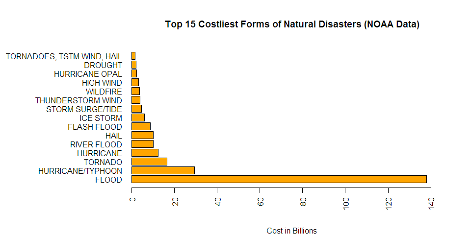

# Public Health and Financial Impact of Natural Disasters in the US
Dr. Vivek Narayan  
November 28, 2017  


###Synopsis
This report has been created for the purposes of completing an end-of-module project for the Reproducible Research Course offered by the Johns Hopkins School Of Public Health on Coursera. For the purposes of the assignment, storm data from the U.S. National Oceanic and Atmospheric Administration (NOAA) [Link](https://www.ncdc.noaa.gov/stormevents/) was analysed to ascertain the public health and financial impact of natural disasters in the US. From NOAA's website, "the database contains storm data from January 1950 [to date] as entered by NOAA's National Weather Service (NWS)". The report was required to be created for the purposes of de-briefing government officials responsible for preparing severe weather events and the report format(html) was required to be uploaded on Rpubs.

###Loading and Processing Data
For the purposes of the assignment data was downloaded from provided URL [link](https://d396qusza40orc.cloudfront.net/repdata%2Fdata%2FStormData.csv.bz2)


```r
library(tidyverse, warn.conflicts = FALSE)
```


```r
DlURL <- "https://d396qusza40orc.cloudfront.net/repdata%2Fdata%2FStormData.csv.bz2"
if(!file.exists("Noaa.bz2")){
  download.file(DlURL, destfile = "./Noaa.bz2")
  }
if(!exists("rawData")){
  rawData <- as.tibble(read.csv(bzfile("./Noaa.bz2")))
  }
```

The function str() was used to identify the column names required for analysis in conjunction with the database documentation from the NOAA website.

A following subsets of data were created for the purposes of analysis:

- Public Health Impact

- Financial Impact

#####Public Health Impact containing Event-type, Fatalities and Injuries

It was decided to separate injuries and fatalities as while fatalities and injuries both need prevention, prevented fatalities potentially become injuries, and injuries, require resources to manage and treat.


```r
##Public Health Subset
PHSubsetData <- rawData %>% select(EVTYPE, FATALITIES, INJURIES) %>% 
  group_by(EVTYPE) %>% summarise_all(sum)
TopInjuries <- PHSubsetData %>% 
  arrange(desc(INJURIES)) %>%
  top_n(10, INJURIES) %>% 
  mutate(INJURIES = INJURIES/1000) ##In 1000s for better graphical representation
TopFatalities <- PHSubsetData %>% 
  arrange(desc(FATALITIES)) %>%
  top_n(10, FATALITIES) %>% 
  mutate(INJURIES = INJURIES/1000) ##In 1000s for better graphical representation
TopPHIssues <- union(TopInjuries, TopFatalities) %>% arrange(desc(FATALITIES))
```

#####Financial Impact containing Eventype and respective columns for property and crop damage.


```r
FinSubsetData <- rawData %>% 
  select(EVTYPE, PROPDMG, PROPDMGEXP, CROPDMG, CROPDMGEXP)
unique(FinSubsetData$PROPDMGEXP)
```

```
##  [1] K M   B m + 0 5 6 ? 4 2 3 h 7 H - 1 8
## Levels:  - ? + 0 1 2 3 4 5 6 7 8 B h H K m M
```

```r
unique(FinSubsetData$CROPDMGEXP)
```

```
## [1]   M K m B ? 0 k 2
## Levels:  ? 0 2 B k K m M
```

Per NOAA documentation column headings "CROPDMGEXP" and "PROPDMGEXP" modify the columns "CROPDMG" and "PROPDMG" by using "B", "M", and "K" to denote figures in Billions, Millions, and Thousands, respectively. For the purposes of this analysis, column entries not strictly denoted with "B", "b", "M", "m", "K", or "k" were dropped. Further more, character notations were substituted with numerical values to aid in computation of the financial impact using gsub(). Finally, three separate subsets were created to convey the results of the analysis. Given that some authorities would be more concerned about crop damage v property damage, it was decided to present those data separately.


```r
FinSubsetData <- FinSubsetData %>%
  filter(!(PROPDMGEXP %in% (c("-", "+", "?", "", "0", "5", "3")))) %>%
  filter(!(CROPDMGEXP %in% (c("-", "+", "?", "", "0"))))
##Function to change the damage suffix to numerical amounts (in Thousands)
SufFun <- function(char){
  char <- as.character(char);
  char <- gsub("m|M", 1000000, char);
  char <- gsub("b|B", 1000000000, char);
  char <- gsub("k|K", 1000, char);
  char <- as.numeric(char)
}
FinSubsetData$CROPDMGEXP <- SufFun(FinSubsetData$CROPDMGEXP)
FinSubsetData$PROPDMGEXP <- SufFun(FinSubsetData$PROPDMGEXP)
##Total Financial Impact
SumFinImpact <- FinSubsetData %>% 
  mutate(Cost = (CROPDMG*CROPDMGEXP) + (PROPDMG*PROPDMGEXP)) %>%
  group_by(EVTYPE) %>% 
  summarise_all(sum) %>%
  mutate(Cost = Cost/10^9) %>%
  arrange(desc(Cost)) %>%
  top_n(15, Cost)
SumFinImpact$Cost <- round(SumFinImpact$Cost, digits = 2)
##Property Damage
PropDamage <- FinSubsetData %>%
  select(EVTYPE, PROPDMG, PROPDMGEXP) %>%
  mutate(Cost = PROPDMG*PROPDMGEXP) %>%
  group_by(EVTYPE) %>% 
  summarise_all(sum) %>%
  mutate(Cost = Cost/10^9) %>%
  arrange(desc(Cost)) %>%
  top_n(10, Cost)
PropDamage$Cost <- round(PropDamage$Cost, digits = 2)
##CropDamage
CropDamage <- FinSubsetData %>%
  select(EVTYPE, CROPDMG, CROPDMGEXP) %>%
  mutate(Cost = CROPDMG*CROPDMGEXP) %>%
  group_by(EVTYPE) %>% 
  summarise_all(sum) %>%
  mutate(Cost = Cost/10^9) %>%
  arrange(desc(Cost)) %>%
  top_n(10, Cost)
CropDamage$Cost <- round(CropDamage$Cost, digits = 2)
```

##Results

###Public Heath Impact Due to Injuries and Fatalities

The following bar-charts were created to visualize the events that cause the most (top ten) impact on public health from the perspective of fatalities and injuries.


```r
par(mar = c(5,11,5,0))
par(mfrow = c(1,2))
barplot(TopPHIssues$FATALITIES, names.arg = TopPHIssues$EVTYPE, las=2, horiz = T, xlim = c(0,6000), main = "Fatalities", col = "pink")
par(mar = c(5,2,5,5))
barplot(TopPHIssues$INJURIES, las=2, horiz = T, main = "Injuries (in 1000's)", xlim = c(0,100), col = "purple")
```

<!-- -->

###Financial Impact Due to Crop and Property Damage

The following bar-charts were created to visualize the events that result in the most (top-ten) financial loss due to severe weather.


```r
par(mfrow = c(1,2))
par(mar = c(5,11,5,0))
barplot(PropDamage$Cost, names.arg = PropDamage$EVTYPE, las=2, horiz = T, xlim = c(0,150), main = "Property Damage Cost in $B", col = "Magenta")
par(mar = c(5,11,5,2))
barplot(CropDamage$Cost, names.arg = CropDamage$EVTYPE, las=2, horiz = T, main = "Crop Damage Cost in $B", xlim = c(0,6), col = "Coral")
```

<!-- -->

Additionally, the following bar-chart was created to visualize the overall financial impact from severe weather.


```r
par(mfrow = c(1,1))
par(mar = c(5,14,5,2))
barplot(SumFinImpact$Cost, names.arg = SumFinImpact$EVTYPE, las=2, horiz = T, main = "Top 15 Costliest Forms of Natural Disasters (NOAA Data)", xlim = c(0,150), col = "Coral", sub = "Cost in Billions")
```

<!-- -->

